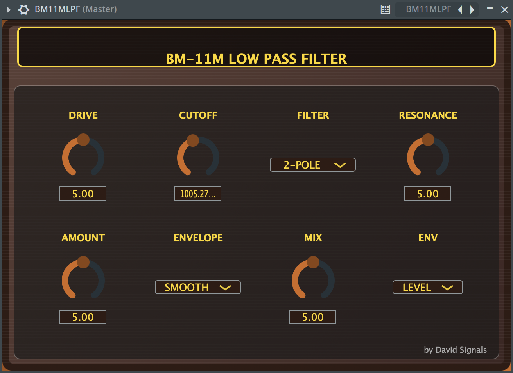
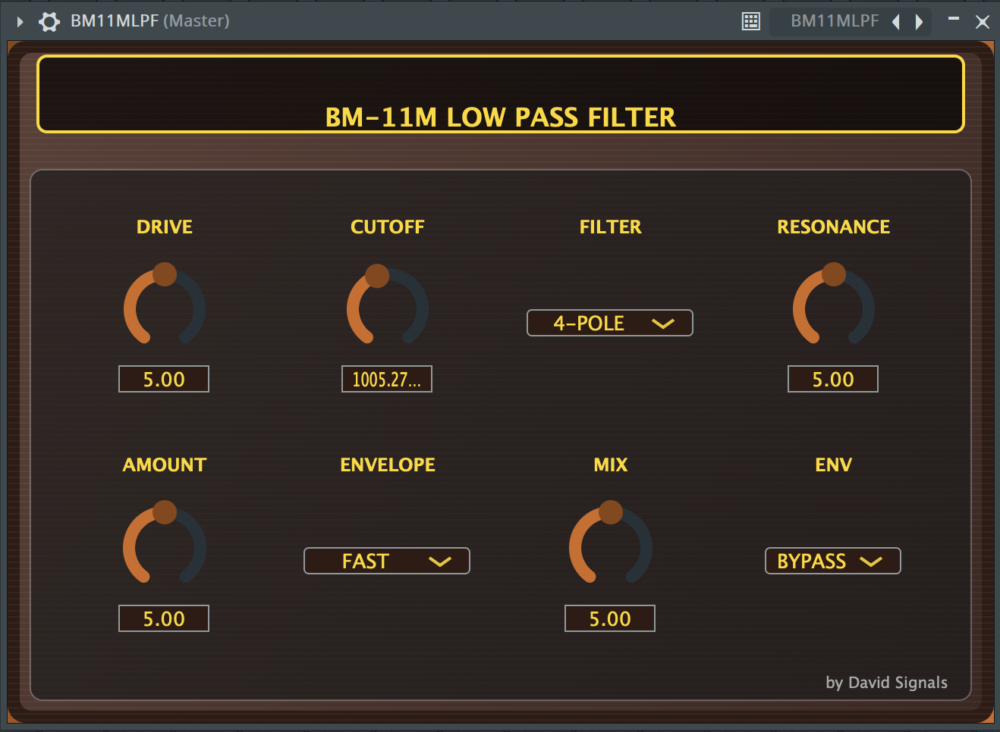

# BM-11M Low Pass Filter

<div align="center">


</div>

A professional analog-modeled low-pass filter plugin based on the classic Behringer BM-11M, developed with JUCE framework.





## 🎛️ Features

- **2-Pole / 4-Pole Filter Modes** (-12dB/oct and -24dB/oct)
- **Drive Control** for input gain saturation
- **Envelope Follower** with Smooth/Fast modes
- **Cutoff Modulation** via envelope amount
- **Resonance Control** for filter emphasis
- **Wet/Dry Mix** for parallel processing
- **Vintage-style UI** with wood texture design

## 🎚️ Controls

| Control | Range | Description |
|---------|-------|-------------|
| **Drive** | 0-10 | Input gain/pre-amplification |
| **Cutoff** | 250Hz-12kHz | Filter cutoff frequency |
| **Filter Mode** | 2-Pole/4-Pole | Filter slope selection |
| **Resonance** | 0-10 | Filter resonance amount |
| **Amount** | 0-10 | Envelope modulation intensity |
| **Envelope** | Smooth/Fast | Envelope follower response |
| **Mix** | 0-10 | Wet/Dry balance |
| **Env Mode** | Bypass/Level | Envelope modulation toggle |

### Technical Architecture
- **AudioProcessorValueTreeState**: Parameter management and automation
- **dsp::LadderFilter**: JUCE's ladder filter for analog emulation
- **dsp::Gain**: Drive stage implementation
- **dsp::Compressor**: Envelope follower using compressor sidechain
- **SmoothedValue**: Parameter smoothing for click-free transitions

## 📋 Dependencies

### Required
- **JUCE 8.0.10** - Cross-platform C++ framework
- **Xcode 14.0+** - macOS development environment
- **macOS 11.0+** - Target operating system

### Optional
- **CMake 3.15+** - Alternative build system
- **Projucer** - JUCE project management tool

## 🔧 Compilation

### System Requirements
- macOS 11.0 or later
- Xcode 14.0 or later
- JUCE 8.0.10 framework

### Build Steps

1. **Clone Repository**
   ```bash
   git clone https://github.com/davidsignals/BM11MLPF.git
   cd BM11MLPF
